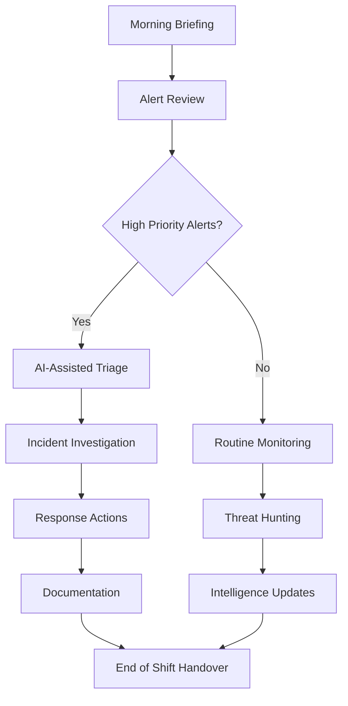
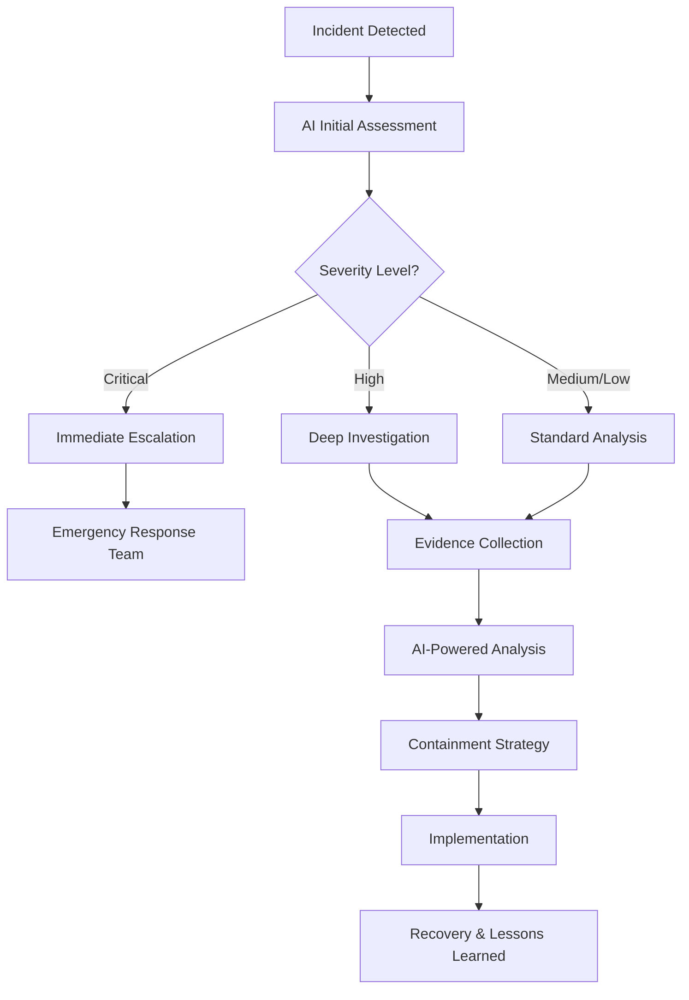
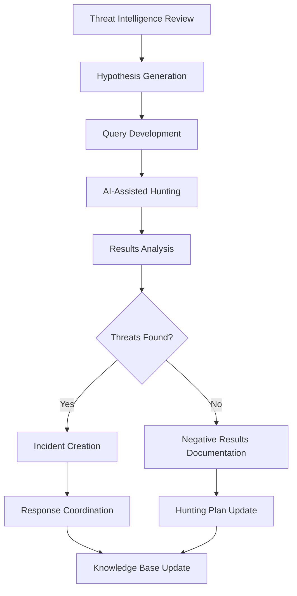

# Security Professional's Guide to Wazuh MCP Server

A comprehensive guide for security professionals, SOC analysts, threat hunters, and security engineers to effectively leverage Wazuh MCP Server for enhanced security operations and AI-powered analysis.

## 📋 Table of Contents

- [Introduction for Security Professionals](#introduction-for-security-professionals)
- [Security Use Cases and Workflows](#security-use-cases-and-workflows)
- [AI-Enhanced Threat Analysis](#ai-enhanced-threat-analysis)
- [Incident Response Integration](#incident-response-integration)
- [Threat Hunting with AI](#threat-hunting-with-ai)
- [Compliance and Audit Operations](#compliance-and-audit-operations)
- [Advanced Security Analytics](#advanced-security-analytics)
- [Security Automation and Orchestration](#security-automation-and-orchestration)
- [Threat Intelligence Integration](#threat-intelligence-integration)
- [Security Metrics and KPIs](#security-metrics-and-kpis)
- [Best Practices for Security Operations](#best-practices-for-security-operations)
- [Integration with Security Stack](#integration-with-security-stack)

---

## 🛡️ Introduction for Security Professionals

### Overview

The Wazuh MCP Server transforms traditional SIEM operations by providing AI-powered security analysis through natural language interfaces. This enables security professionals to perform complex analysis, correlate threats, and generate actionable intelligence faster than ever before.

### Key Capabilities for Security Teams

- **AI-Powered Analysis**: Leverage Claude's advanced reasoning for threat analysis
- **Natural Language Queries**: Query your security data using plain English
- **Automated Correlation**: AI-driven event correlation and pattern recognition
- **Rapid Investigation**: Fast deep-dive analysis of security incidents
- **Contextual Intelligence**: Rich context and recommendations for security events
- **Compliance Automation**: Automated compliance checking and reporting

### Architecture for Security Operations

```
┌─────────────────────────────────────────┐
│          Security Analyst Layer         │
│  ├─ SOC Analysts                       │
│  ├─ Threat Hunters                     │
│  ├─ Incident Responders                │
│  └─ Security Engineers                 │
└─────────────────────────────────────────┘
               │ Natural Language Queries
┌─────────────────────────────────────────┐
│            AI Analysis Layer            │
│  ├─ Claude AI Engine                   │
│  ├─ Threat Pattern Recognition         │
│  ├─ Behavioral Analysis                │
│  └─ Risk Assessment                    │
└─────────────────────────────────────────┘
               │ MCP Protocol
┌─────────────────────────────────────────┐
│          Wazuh MCP Server               │
│  ├─ Security Tool Orchestration        │
│  ├─ Data Aggregation & Correlation     │
│  ├─ Real-time Event Processing         │
│  └─ Security Analytics Engine          │
└─────────────────────────────────────────┘
               │ API Calls
┌─────────────────────────────────────────┐
│         Wazuh SIEM Platform             │
│  ├─ Agent Data Collection              │
│  ├─ Log Analysis & Processing          │
│  ├─ Rule Engine & Alerts               │
│  └─ Security Event Storage             │
└─────────────────────────────────────────┘
```

---

## 🔍 Security Use Cases and Workflows

### Primary Use Cases

#### 1. Security Alert Triage and Analysis

**Scenario**: SOC analyst needs to quickly assess and prioritize incoming security alerts.

**Workflow**:
```
1. Request: "Show me critical security alerts from the last 4 hours and analyze their severity"
2. AI Analysis: Retrieves alerts, correlates with threat intelligence, assesses impact
3. Output: Prioritized alert list with recommended actions
4. Follow-up: "Investigate the authentication failures in detail"
```

**Sample Query**:
> "Analyze the recent failed authentication attempts. Are there any patterns suggesting brute force attacks? What's the risk level and what should we do?"

**Expected AI Response**:
- Summary of authentication failure patterns
- Geographical analysis of source IPs
- Timeline of attack progression
- Risk assessment and recommended actions
- Automated response suggestions

#### 2. Incident Investigation and Forensics

**Scenario**: Security incident requires deep investigation and evidence collection.

**Workflow**:
```
1. Initial Query: "Investigate suspicious activity on agent-web-01 between 2PM and 4PM today"
2. AI Analysis: Correlates logs, identifies anomalies, builds attack timeline
3. Evidence Collection: Gathers relevant artifacts and indicators
4. Report Generation: Creates investigation summary with evidence
```

**Advanced Investigation Queries**:
```
"What happened on server 192.168.1.50 that triggered the malware alert?"
"Show me all network connections and file modifications during the incident window"
"Are there any lateral movement indicators related to this compromise?"
"Generate a timeline of events leading to the security breach"
```

#### 3. Threat Hunting Operations

**Scenario**: Proactive threat hunting to identify hidden threats and advanced persistent threats (APTs).

**Hunting Queries**:
```
"Hunt for signs of lateral movement using living-off-the-land techniques"
"Identify any unusual PowerShell activity that might indicate attack progression"
"Find anomalous network traffic patterns that could suggest data exfiltration"
"Look for persistence mechanisms commonly used by APT groups"
```

**AI-Enhanced Hunting**:
- Behavioral baseline analysis
- Anomaly detection and correlation
- IOC generation and validation
- Attack technique mapping (MITRE ATT&CK)

#### 4. Compliance and Audit Support

**Scenario**: Demonstrating compliance with security frameworks and standards.

**Compliance Queries**:
```
"Generate a PCI DSS compliance report for the last quarter"
"Show evidence of access control effectiveness for SOC 2 audit"
"Verify that all privileged access is properly logged and monitored"
"Demonstrate incident response capability and timeline adherence"
```

### Security Operations Workflows

#### Daily SOC Operations



#### Incident Response Workflow



---

## 🤖 AI-Enhanced Threat Analysis

### Advanced Analysis Capabilities

#### Behavioral Analysis

The AI engine provides sophisticated behavioral analysis capabilities:

**Network Behavior Analysis**:
```
Query: "Analyze network traffic patterns for the last week and identify any anomalies"

AI Analysis:
- Baseline traffic pattern establishment
- Deviation detection and quantification
- Protocol analysis and anomaly identification
- Temporal pattern analysis
- Risk scoring and prioritization
```

**User Behavior Analytics (UBA)**:
```
Query: "Examine user john.doe's activity patterns and identify any suspicious behavior"

AI Response:
- Login pattern analysis
- Resource access patterns
- Privilege escalation detection
- Off-hours activity analysis
- Geographical anomaly detection
```

#### Threat Pattern Recognition

**Advanced Persistent Threat (APT) Detection**:
```python
# Example threat hunting query structure
threat_patterns = {
    "apt_indicators": [
        "Long-term presence indicators",
        "Living-off-the-land techniques",
        "Custom malware signatures",
        "Command and control patterns",
        "Data staging and exfiltration"
    ],
    "behavioral_indicators": [
        "Abnormal login patterns",
        "Privilege escalation chains",
        "Lateral movement techniques",
        "Persistence mechanisms",
        "Anti-forensics activities"
    ]
}
```

**Sample APT Hunting Query**:
> "Hunt for APT indicators in our environment. Look for signs of long-term persistence, lateral movement, and data staging activities. Focus on the last 30 days and correlate with known APT TTPs."

#### Malware Analysis and Attribution

**Malware Family Identification**:
```
Query: "Analyze the detected malware sample and identify its family, capabilities, and potential attribution"

AI Analysis:
- Hash comparison with threat intelligence
- Behavioral pattern matching
- TTPs alignment with known groups
- Infrastructure analysis
- Attribution likelihood scoring
```

### Real-Time Threat Intelligence Integration

#### Dynamic IOC Analysis

```python
# AI-powered IOC analysis workflow
class ThreatIntelligenceAnalysis:
    """AI-enhanced threat intelligence analysis."""
    
    def analyze_indicators(self, iocs: List[str]) -> Dict[str, Any]:
        """Analyze indicators of compromise using AI."""
        
        analysis = {
            "ioc_analysis": {},
            "threat_landscape": {},
            "risk_assessment": {},
            "recommendations": []
        }
        
        for ioc in iocs:
            # AI-powered analysis
            ioc_intel = self.ai_analyze_ioc(ioc)
            analysis["ioc_analysis"][ioc] = ioc_intel
            
        return analysis
    
    def ai_analyze_ioc(self, ioc: str) -> Dict[str, Any]:
        """AI analysis of individual IOC."""
        
        return {
            "type": self.classify_ioc_type(ioc),
            "threat_level": self.assess_threat_level(ioc),
            "context": self.get_threat_context(ioc),
            "attribution": self.analyze_attribution(ioc),
            "recommendations": self.generate_recommendations(ioc)
        }
```

#### Automated Threat Attribution

**Attribution Analysis Queries**:
```
"Analyze the attack patterns and provide threat actor attribution assessment"
"What APT groups use similar TTPs to what we observed in this incident?"
"Based on the infrastructure and malware, which threat actors are most likely responsible?"
```

**AI Attribution Framework**:
- Infrastructure analysis and fingerprinting
- TTP mapping to known threat actors
- Malware family correlation
- Geopolitical context analysis
- Confidence scoring and assessment

---

## 🚨 Incident Response Integration

### AI-Assisted Incident Response

#### Automated Incident Classification

```python
class IncidentClassifier:
    """AI-powered incident classification and routing."""
    
    def classify_incident(self, incident_data: Dict[str, Any]) -> Dict[str, Any]:
        """Classify incident using AI analysis."""
        
        classification = {
            "severity": self.assess_severity(incident_data),
            "category": self.categorize_incident(incident_data),
            "affected_assets": self.identify_assets(incident_data),
            "potential_impact": self.assess_impact(incident_data),
            "response_recommendations": self.recommend_response(incident_data)
        }
        
        return classification
    
    def assess_severity(self, incident_data: Dict[str, Any]) -> str:
        """AI assessment of incident severity."""
        # Advanced logic for severity assessment
        pass
    
    def recommend_response(self, incident_data: Dict[str, Any]) -> List[str]:
        """Generate AI-powered response recommendations."""
        # Intelligent response recommendation engine
        pass
```

#### Incident Response Playbooks

**Malware Incident Response**:
```
AI Query: "We detected malware on workstation WS-001. Guide me through the incident response process."

AI Response:
1. Immediate containment recommendations
2. Evidence preservation steps
3. Impact assessment guidance
4. Eradication procedures
5. Recovery validation steps
6. Lessons learned documentation
```

**Data Breach Response**:
```
AI Query: "Potential data breach detected. What are the immediate steps and what data might be at risk?"

AI Analysis:
- Breach scope assessment
- Data classification review
- Regulatory notification requirements
- Stakeholder communication plan
- Legal and compliance considerations
```

#### Automated Evidence Collection

**Digital Forensics Integration**:
```python
class ForensicsCollector:
    """AI-guided digital forensics evidence collection."""
    
    def collect_evidence(self, incident_id: str, systems: List[str]) -> Dict[str, Any]:
        """Collect forensics evidence with AI guidance."""
        
        evidence_plan = self.ai_generate_collection_plan(incident_id, systems)
        
        for system in systems:
            evidence = {
                "memory_dump": self.collect_memory(system),
                "disk_images": self.collect_disk_images(system),
                "network_traffic": self.collect_network_data(system),
                "log_files": self.collect_relevant_logs(system),
                "volatile_data": self.collect_volatile_data(system)
            }
            
        return evidence_plan
    
    def ai_generate_collection_plan(self, incident_id: str, systems: List[str]) -> Dict[str, Any]:
        """AI-generated evidence collection plan."""
        # Intelligent evidence collection planning
        pass
```

### Incident Response Metrics and KPIs

#### Response Time Analysis

**Mean Time to Detection (MTTD)**:
```
Query: "What's our average time to detect security incidents and how can we improve it?"

AI Analysis:
- Historical MTTD calculation
- Trend analysis and patterns
- Improvement recommendations
- Benchmark comparison
```

**Mean Time to Response (MTTR)**:
```
Query: "Analyze our incident response times and identify bottlenecks in our process"

AI Response:
- Response time breakdown by phase
- Process bottleneck identification
- Resource allocation recommendations
- Automation opportunities
```

---

## 🎯 Threat Hunting with AI

### Advanced Threat Hunting Techniques

#### Hypothesis-Driven Hunting

**Hunting Hypothesis Development**:
```python
class ThreatHuntingEngine:
    """AI-powered threat hunting framework."""
    
    def generate_hunting_hypotheses(self, threat_landscape: Dict[str, Any]) -> List[Dict[str, Any]]:
        """Generate threat hunting hypotheses using AI."""
        
        hypotheses = []
        
        # APT-focused hypotheses
        hypotheses.extend(self.generate_apt_hypotheses(threat_landscape))
        
        # Insider threat hypotheses
        hypotheses.extend(self.generate_insider_hypotheses(threat_landscape))
        
        # Infrastructure compromise hypotheses
        hypotheses.extend(self.generate_infrastructure_hypotheses(threat_landscape))
        
        return hypotheses
    
    def test_hypothesis(self, hypothesis: Dict[str, Any]) -> Dict[str, Any]:
        """Test hunting hypothesis using AI analysis."""
        
        results = {
            "hypothesis": hypothesis,
            "test_results": self.execute_hunting_queries(hypothesis["queries"]),
            "findings": self.analyze_results(hypothesis),
            "confidence_score": self.calculate_confidence(hypothesis),
            "next_steps": self.recommend_next_steps(hypothesis)
        }
        
        return results
```

#### Behavioral Hunting Techniques

**Anomaly-Based Hunting**:
```
Hunting Query: "Hunt for anomalous authentication patterns that might indicate credential compromise"

AI Hunting Process:
1. Baseline authentication behavior analysis
2. Statistical anomaly detection
3. Temporal pattern analysis
4. Geographical anomaly identification
5. Risk scoring and prioritization
```

**TTP-Based Hunting**:
```
Query: "Hunt for evidence of MITRE ATT&CK technique T1055 (Process Injection) in our environment"

AI Analysis:
- Process creation pattern analysis
- Memory injection detection
- DLL loading anomalies
- Parent-child process relationships
- Behavioral indicator correlation
```

#### Threat Intelligence-Driven Hunting

**IOC-Based Hunting**:
```python
def hunt_with_iocs(iocs: List[str], timeframe: str) -> Dict[str, Any]:
    """Hunt for threats using IOCs with AI enhancement."""
    
    hunting_results = {
        "ioc_matches": [],
        "related_activities": [],
        "threat_actor_attribution": {},
        "risk_assessment": {},
        "response_recommendations": []
    }
    
    for ioc in iocs:
        # AI-enhanced IOC hunting
        matches = ai_hunt_ioc(ioc, timeframe)
        hunting_results["ioc_matches"].extend(matches)
    
    # AI correlation and analysis
    hunting_results = ai_correlate_findings(hunting_results)
    
    return hunting_results
```

### Proactive Threat Hunting Workflows

#### Daily Hunting Operations



#### Hunt Team Collaboration

**Collaborative Hunting Queries**:
```
"Share the hunting results for lateral movement detection with the team and get recommendations for follow-up hunts"

"What hunting techniques have been most effective for our threat landscape in the last quarter?"

"Generate a hunting report for management showing our proactive threat detection capabilities"
```

---

## ⚖️ Compliance and Audit Operations

### Automated Compliance Monitoring

#### Framework-Specific Compliance

**PCI DSS Compliance**:
```python
class PCIDSSCompliance:
    """AI-powered PCI DSS compliance monitoring."""
    
    def assess_compliance(self) -> Dict[str, Any]:
        """Assess PCI DSS compliance using AI analysis."""
        
        compliance_report = {
            "requirement_1": self.assess_firewall_policies(),
            "requirement_2": self.assess_default_passwords(),
            "requirement_3": self.assess_data_protection(),
            "requirement_4": self.assess_encryption_transit(),
            "requirement_7": self.assess_access_controls(),
            "requirement_8": self.assess_user_authentication(),
            "requirement_10": self.assess_logging_monitoring(),
            "requirement_11": self.assess_security_testing()
        }
        
        return compliance_report
    
    def assess_access_controls(self) -> Dict[str, Any]:
        """AI assessment of access control compliance."""
        
        analysis = {
            "access_control_policies": self.analyze_access_policies(),
            "privilege_management": self.analyze_privilege_usage(),
            "access_reviews": self.verify_access_reviews(),
            "compliance_score": self.calculate_compliance_score(),
            "recommendations": self.generate_remediation_actions()
        }
        
        return analysis
```

**GDPR Privacy Compliance**:
```
Compliance Query: "Assess our GDPR compliance posture and identify any data privacy risks"

AI Analysis:
- Data processing activity review
- Consent mechanism assessment
- Data retention policy compliance
- Cross-border transfer validation
- Privacy impact assessment
- Breach notification readiness
```

#### Audit Trail Generation

**Comprehensive Audit Trails**:
```python
class AuditTrailGenerator:
    """AI-enhanced audit trail generation."""
    
    def generate_audit_trail(
        self, 
        start_date: datetime, 
        end_date: datetime,
        scope: List[str]
    ) -> Dict[str, Any]:
        """Generate comprehensive audit trail with AI analysis."""
        
        audit_trail = {
            "access_events": self.collect_access_events(start_date, end_date),
            "configuration_changes": self.collect_config_changes(start_date, end_date),
            "security_events": self.collect_security_events(start_date, end_date),
            "administrative_actions": self.collect_admin_actions(start_date, end_date),
            "ai_analysis": self.ai_analyze_audit_data(audit_trail),
            "compliance_mapping": self.map_to_requirements(audit_trail),
            "risk_assessment": self.assess_audit_risks(audit_trail)
        }
        
        return audit_trail
```

### Regulatory Reporting

#### Automated Report Generation

**SOC 2 Type II Reporting**:
```
Query: "Generate a SOC 2 Type II compliance report for the security controls over the last 12 months"

AI Report Generation:
- Control effectiveness assessment
- Evidence collection and validation
- Gap analysis and remediation tracking
- Management assertions review
- Independent verification results
```

**NIST Cybersecurity Framework Reporting**:
```
Query: "Create a NIST CSF maturity assessment showing our current posture and improvement roadmap"

AI Analysis:
- Function maturity scoring (Identify, Protect, Detect, Respond, Recover)
- Subcategory implementation assessment
- Gap identification and prioritization
- Improvement roadmap development
- Resource allocation recommendations
```

---

## 📊 Advanced Security Analytics

### AI-Powered Security Metrics

#### Security Posture Assessment

```python
class SecurityPostureAnalyzer:
    """AI-driven security posture analysis."""
    
    def assess_security_posture(self) -> Dict[str, Any]:
        """Comprehensive security posture assessment."""
        
        posture_analysis = {
            "threat_landscape": self.analyze_threat_landscape(),
            "vulnerability_posture": self.assess_vulnerability_management(),
            "incident_response_capability": self.evaluate_response_capability(),
            "security_awareness": self.assess_security_awareness(),
            "technology_effectiveness": self.evaluate_security_tools(),
            "overall_score": self.calculate_posture_score(),
            "improvement_recommendations": self.generate_recommendations()
        }
        
        return posture_analysis
    
    def analyze_threat_landscape(self) -> Dict[str, Any]:
        """AI analysis of organizational threat landscape."""
        
        return {
            "active_threats": self.identify_active_threats(),
            "threat_trends": self.analyze_threat_trends(),
            "industry_threats": self.correlate_industry_threats(),
            "threat_actor_activity": self.assess_threat_actors(),
            "emerging_threats": self.predict_emerging_threats()
        }
```

#### Risk-Based Analytics

**Risk Scoring and Prioritization**:
```
Query: "Calculate risk scores for all our critical assets and prioritize security investments"

AI Risk Analysis:
- Asset value and criticality assessment
- Threat likelihood calculation
- Vulnerability exposure analysis
- Impact assessment modeling
- Risk treatment recommendations
```

**Attack Surface Analysis**:
```python
def analyze_attack_surface() -> Dict[str, Any]:
    """AI-powered attack surface analysis."""
    
    attack_surface = {
        "external_exposure": {
            "public_services": identify_public_services(),
            "dns_records": analyze_dns_exposure(),
            "certificate_analysis": assess_certificate_posture(),
            "third_party_exposure": evaluate_vendor_risks()
        },
        "internal_exposure": {
            "network_segmentation": assess_network_segmentation(),
            "privilege_escalation_paths": map_privilege_paths(),
            "lateral_movement_risks": identify_lateral_risks(),
            "insider_threat_vectors": assess_insider_risks()
        },
        "application_security": {
            "web_app_vulnerabilities": scan_web_applications(),
            "api_security": assess_api_security(),
            "mobile_app_risks": evaluate_mobile_security(),
            "cloud_configuration": assess_cloud_security()
        }
    }
    
    return attack_surface
```

### Predictive Security Analytics

#### Threat Prediction Models

**Attack Likelihood Prediction**:
```python
class ThreatPredictionEngine:
    """AI-powered threat prediction and forecasting."""
    
    def predict_attack_likelihood(
        self, 
        timeframe: int,
        threat_types: List[str]
    ) -> Dict[str, Any]:
        """Predict likelihood of specific attacks."""
        
        predictions = {}
        
        for threat_type in threat_types:
            prediction = {
                "threat_type": threat_type,
                "likelihood_score": self.calculate_likelihood(threat_type, timeframe),
                "confidence_interval": self.calculate_confidence(threat_type),
                "contributing_factors": self.identify_risk_factors(threat_type),
                "mitigation_recommendations": self.recommend_mitigations(threat_type)
            }
            
            predictions[threat_type] = prediction
        
        return predictions
    
    def forecast_security_trends(self, forecast_period: int) -> Dict[str, Any]:
        """Forecast security trends and threat evolution."""
        
        forecast = {
            "emerging_threats": self.predict_emerging_threats(forecast_period),
            "attack_evolution": self.predict_attack_evolution(forecast_period),
            "vulnerability_trends": self.predict_vulnerability_trends(forecast_period),
            "defense_requirements": self.predict_defense_needs(forecast_period)
        }
        
        return forecast
```

#### Behavioral Baseline Modeling

**User Behavior Modeling**:
```
Query: "Establish behavioral baselines for privileged users and detect anomalies"

AI Modeling Process:
1. Historical behavior pattern analysis
2. Statistical baseline establishment
3. Machine learning model training
4. Anomaly detection threshold setting
5. Continuous model refinement
```

**Network Behavior Analysis**:
```python
def model_network_behavior() -> Dict[str, Any]:
    """AI-driven network behavior modeling."""
    
    behavior_model = {
        "traffic_patterns": {
            "baseline_volume": calculate_baseline_traffic(),
            "protocol_distribution": analyze_protocol_usage(),
            "communication_patterns": map_communication_flows(),
            "temporal_patterns": identify_time_patterns()
        },
        "anomaly_detection": {
            "volume_anomalies": detect_traffic_anomalies(),
            "protocol_anomalies": detect_protocol_anomalies(),
            "timing_anomalies": detect_temporal_anomalies(),
            "destination_anomalies": detect_destination_anomalies()
        },
        "threat_indicators": {
            "c2_communication": detect_c2_patterns(),
            "data_exfiltration": detect_exfiltration_patterns(),
            "lateral_movement": detect_lateral_movement(),
            "reconnaissance": detect_recon_activities()
        }
    }
    
    return behavior_model
```

---

## 🔄 Security Automation and Orchestration

### AI-Driven Security Orchestration

#### Automated Response Workflows

```python
class SecurityOrchestrator:
    """AI-powered security automation and orchestration."""
    
    def orchestrate_incident_response(self, incident: Dict[str, Any]) -> Dict[str, Any]:
        """Orchestrate automated incident response."""
        
        response_plan = self.ai_generate_response_plan(incident)
        
        orchestration_result = {
            "incident_id": incident["id"],
            "response_plan": response_plan,
            "automated_actions": [],
            "manual_actions": [],
            "approval_required": [],
            "execution_status": "initiated"
        }
        
        # Execute automated actions
        for action in response_plan["automated_actions"]:
            result = self.execute_automation(action)
            orchestration_result["automated_actions"].append(result)
        
        # Queue manual actions
        for action in response_plan["manual_actions"]:
            self.queue_manual_action(action)
            orchestration_result["manual_actions"].append(action)
        
        return orchestration_result
    
    def ai_generate_response_plan(self, incident: Dict[str, Any]) -> Dict[str, Any]:
        """AI-generated incident response plan."""
        
        plan = {
            "containment_actions": self.plan_containment(incident),
            "investigation_actions": self.plan_investigation(incident),
            "eradication_actions": self.plan_eradication(incident),
            "recovery_actions": self.plan_recovery(incident),
            "communication_actions": self.plan_communications(incident)
        }
        
        return plan
```

#### Intelligent Alert Correlation

**Multi-Source Alert Correlation**:
```python
class AlertCorrelationEngine:
    """AI-powered alert correlation and deduplication."""
    
    def correlate_alerts(self, alerts: List[Dict[str, Any]]) -> Dict[str, Any]:
        """Correlate and deduplicate security alerts using AI."""
        
        correlation_result = {
            "original_alerts": len(alerts),
            "correlated_incidents": [],
            "false_positives": [],
            "duplicate_alerts": [],
            "correlation_confidence": 0.0
        }
        
        # AI-powered clustering and correlation
        clusters = self.ai_cluster_alerts(alerts)
        
        for cluster in clusters:
            incident = self.create_incident_from_cluster(cluster)
            correlation_result["correlated_incidents"].append(incident)
        
        return correlation_result
    
    def ai_cluster_alerts(self, alerts: List[Dict[str, Any]]) -> List[List[Dict[str, Any]]]:
        """AI-based alert clustering."""
        # Advanced machine learning clustering algorithm
        pass
```

### SOAR Integration

#### Playbook Automation

**Malware Response Automation**:
```yaml
# malware-response-playbook.yml
playbook:
  name: "AI-Enhanced Malware Response"
  trigger: "malware_detection"
  
  actions:
    - name: "AI Analysis"
      type: "ai_analysis"
      inputs:
        - malware_sample
        - affected_systems
        - network_traffic
      outputs:
        - threat_assessment
        - attribution_analysis
        - impact_prediction
    
    - name: "Automated Containment"
      type: "containment"
      conditions:
        - threat_level: "high"
      actions:
        - isolate_systems
        - block_network_traffic
        - disable_user_accounts
    
    - name: "Evidence Collection"
      type: "forensics"
      actions:
        - collect_memory_dumps
        - preserve_disk_images
        - capture_network_pcaps
    
    - name: "Threat Hunting"
      type: "hunting"
      inputs:
        - iocs_from_analysis
      actions:
        - hunt_similar_threats
        - expand_investigation
```

**Phishing Response Automation**:
```python
def automate_phishing_response(phishing_alert: Dict[str, Any]) -> Dict[str, Any]:
    """Automated phishing email response."""
    
    response_actions = {
        "email_analysis": ai_analyze_phishing_email(phishing_alert),
        "user_notification": notify_affected_users(phishing_alert),
        "email_quarantine": quarantine_malicious_emails(phishing_alert),
        "domain_blocking": block_malicious_domains(phishing_alert),
        "user_training": trigger_security_awareness(phishing_alert),
        "threat_intelligence": update_threat_feeds(phishing_alert)
    }
    
    return response_actions
```

---

## 🌐 Threat Intelligence Integration

### AI-Enhanced Threat Intelligence

#### Intelligence Collection and Analysis

```python
class ThreatIntelligenceProcessor:
    """AI-powered threat intelligence processing."""
    
    def process_intelligence_feeds(self, feeds: List[str]) -> Dict[str, Any]:
        """Process and analyze threat intelligence feeds."""
        
        intelligence_analysis = {
            "ioc_analysis": {},
            "threat_actor_updates": {},
            "campaign_tracking": {},
            "tactical_intelligence": {},
            "strategic_assessments": {}
        }
        
        for feed in feeds:
            feed_data = self.ingest_feed(feed)
            ai_analysis = self.ai_analyze_feed(feed_data)
            intelligence_analysis = self.merge_analysis(intelligence_analysis, ai_analysis)
        
        return intelligence_analysis
    
    def ai_analyze_feed(self, feed_data: Dict[str, Any]) -> Dict[str, Any]:
        """AI analysis of threat intelligence feed."""
        
        analysis = {
            "ioc_extraction": self.extract_iocs(feed_data),
            "attribution_analysis": self.analyze_attribution(feed_data),
            "ttp_mapping": self.map_ttps(feed_data),
            "relevance_scoring": self.score_relevance(feed_data),
            "actionable_intelligence": self.generate_actionable_intel(feed_data)
        }
        
        return analysis
```

#### Contextual Intelligence Generation

**Threat Actor Profiling**:
```
Query: "Create a comprehensive threat actor profile for APT29 including recent TTPs and targeting patterns"

AI Intelligence Report:
- Historical activity analysis
- Current campaign assessment
- TTP evolution tracking
- Infrastructure analysis
- Targeting pattern identification
- Defensive recommendations
```

**Campaign Attribution**:
```python
def attribute_campaign(campaign_data: Dict[str, Any]) -> Dict[str, Any]:
    """AI-powered campaign attribution analysis."""
    
    attribution = {
        "primary_attribution": analyze_primary_indicators(campaign_data),
        "secondary_attribution": analyze_secondary_indicators(campaign_data),
        "confidence_assessment": calculate_attribution_confidence(campaign_data),
        "supporting_evidence": collect_attribution_evidence(campaign_data),
        "alternative_hypotheses": generate_alternative_attributions(campaign_data)
    }
    
    return attribution
```

### Intelligence-Driven Defense

#### Proactive Defense Recommendations

**Intelligence-Based Hunting**:
```
Query: "Based on the latest threat intelligence, what should we hunt for in our environment?"

AI Hunting Recommendations:
- IOC-based hunt queries
- Behavioral hunting techniques
- Infrastructure pattern searches
- TTP-based detection rules
- Anomaly detection tuning
```

**Threat-Informed Defense Updates**:
```python
def update_defenses_with_intelligence(intel: Dict[str, Any]) -> Dict[str, Any]:
    """Update defensive measures based on threat intelligence."""
    
    defense_updates = {
        "detection_rules": generate_detection_rules(intel),
        "ioc_feeds": update_ioc_feeds(intel),
        "hunting_queries": create_hunting_queries(intel),
        "preventive_controls": recommend_preventive_measures(intel),
        "monitoring_enhancements": suggest_monitoring_improvements(intel)
    }
    
    return defense_updates
```

---

## 📈 Security Metrics and KPIs

### AI-Driven Security Metrics

#### Security Effectiveness Metrics

```python
class SecurityMetricsAnalyzer:
    """AI-powered security metrics analysis."""
    
    def calculate_security_effectiveness(self) -> Dict[str, Any]:
        """Calculate comprehensive security effectiveness metrics."""
        
        effectiveness_metrics = {
            "detection_metrics": {
                "mean_time_to_detection": self.calculate_mttd(),
                "detection_accuracy": self.calculate_detection_accuracy(),
                "false_positive_rate": self.calculate_fpr(),
                "coverage_assessment": self.assess_detection_coverage()
            },
            "response_metrics": {
                "mean_time_to_response": self.calculate_mttr(),
                "containment_effectiveness": self.assess_containment(),
                "recovery_time": self.calculate_recovery_time(),
                "incident_resolution_rate": self.calculate_resolution_rate()
            },
            "prevention_metrics": {
                "attack_prevention_rate": self.calculate_prevention_rate(),
                "vulnerability_management": self.assess_vuln_management(),
                "patch_compliance": self.calculate_patch_compliance(),
                "security_awareness": self.assess_awareness_effectiveness()
            }
        }
        
        return effectiveness_metrics
    
    def generate_executive_dashboard(self) -> Dict[str, Any]:
        """Generate executive security dashboard with AI insights."""
        
        dashboard = {
            "security_posture_score": self.calculate_overall_posture(),
            "risk_trends": self.analyze_risk_trends(),
            "threat_landscape": self.assess_threat_environment(),
            "investment_recommendations": self.recommend_investments(),
            "benchmark_comparison": self.compare_with_industry(),
            "improvement_roadmap": self.generate_improvement_plan()
        }
        
        return dashboard
```

#### Predictive Security Metrics

**Trend Analysis and Forecasting**:
```
Query: "Analyze security metrics trends and predict future security challenges"

AI Trend Analysis:
- Historical performance trend analysis
- Seasonal pattern identification
- Predictive modeling for future threats
- Resource requirement forecasting
- Investment ROI projections
```

**Risk Exposure Metrics**:
```python
def calculate_risk_exposure() -> Dict[str, Any]:
    """Calculate organizational risk exposure with AI analysis."""
    
    risk_exposure = {
        "current_risk_score": calculate_current_risk(),
        "risk_velocity": analyze_risk_velocity(),
        "threat_exposure": assess_threat_exposure(),
        "vulnerability_exposure": assess_vulnerability_exposure(),
        "control_effectiveness": evaluate_control_effectiveness(),
        "residual_risk": calculate_residual_risk(),
        "risk_appetite_alignment": assess_risk_appetite()
    }
    
    return risk_exposure
```

### Performance Optimization

#### Security Tool Effectiveness

**SIEM Performance Analysis**:
```
Query: "Analyze our SIEM performance and identify optimization opportunities"

AI Performance Analysis:
- Log ingestion rate analysis
- Query performance optimization
- Storage utilization assessment
- Alert quality evaluation
- Rule effectiveness scoring
- Resource allocation recommendations
```

**Security Stack Assessment**:
```python
def assess_security_stack_performance() -> Dict[str, Any]:
    """Assess overall security stack performance."""
    
    stack_assessment = {
        "tool_effectiveness": evaluate_individual_tools(),
        "integration_efficiency": assess_tool_integration(),
        "coverage_gaps": identify_coverage_gaps(),
        "redundancy_analysis": analyze_tool_redundancy(),
        "cost_effectiveness": calculate_cost_effectiveness(),
        "optimization_recommendations": generate_optimization_plan()
    }
    
    return stack_assessment
```

---

## 🎓 Best Practices for Security Operations

### AI-Enhanced SOC Operations

#### Shift Handover Optimization

```python
class ShiftHandoverManager:
    """AI-enhanced shift handover management."""
    
    def generate_handover_briefing(self) -> Dict[str, Any]:
        """Generate intelligent shift handover briefing."""
        
        briefing = {
            "current_incidents": self.summarize_active_incidents(),
            "emerging_threats": self.identify_emerging_threats(),
            "system_status": self.assess_system_health(),
            "priority_actions": self.recommend_priority_actions(),
            "threat_landscape_updates": self.provide_threat_updates(),
            "performance_metrics": self.generate_shift_metrics(),
            "ai_insights": self.provide_ai_insights()
        }
        
        return briefing
    
    def provide_ai_insights(self) -> List[str]:
        """Provide AI-generated insights for incoming shift."""
        
        insights = [
            "Unusual authentication patterns detected in the last 4 hours",
            "Increased phishing attempts targeting finance department",
            "Potential APT activity requiring continued monitoring",
            "New malware variant signatures available for hunting",
            "Critical vulnerability patches pending deployment"
        ]
        
        return insights
```

#### Continuous Improvement Framework

**Security Process Optimization**:
```
Query: "Analyze our security processes and recommend improvements for efficiency and effectiveness"

AI Process Analysis:
- Workflow efficiency assessment
- Bottleneck identification
- Automation opportunity analysis
- Resource optimization recommendations
- Quality improvement suggestions
```

**Training and Skill Development**:
```python
def assess_team_capabilities() -> Dict[str, Any]:
    """AI assessment of security team capabilities."""
    
    capability_assessment = {
        "skill_gaps": identify_skill_gaps(),
        "training_recommendations": recommend_training(),
        "cross_training_opportunities": identify_cross_training(),
        "expertise_development": plan_expertise_development(),
        "performance_improvement": suggest_performance_improvements()
    }
    
    return capability_assessment
```

### Quality Assurance

#### Alert Quality Management

```python
class AlertQualityManager:
    """AI-powered alert quality management."""
    
    def assess_alert_quality(self, timeframe: str) -> Dict[str, Any]:
        """Assess and improve alert quality using AI."""
        
        quality_assessment = {
            "true_positive_rate": self.calculate_tpr(timeframe),
            "false_positive_analysis": self.analyze_false_positives(timeframe),
            "alert_fatigue_indicators": self.assess_alert_fatigue(timeframe),
            "tuning_recommendations": self.recommend_rule_tuning(timeframe),
            "new_detection_opportunities": self.identify_detection_gaps(timeframe)
        }
        
        return quality_assessment
    
    def recommend_rule_tuning(self, timeframe: str) -> List[Dict[str, Any]]:
        """AI recommendations for detection rule tuning."""
        
        recommendations = []
        
        # Analyze high-noise rules
        noisy_rules = self.identify_noisy_rules(timeframe)
        for rule in noisy_rules:
            recommendation = {
                "rule_id": rule["id"],
                "issue": "High false positive rate",
                "current_fpr": rule["false_positive_rate"],
                "recommended_changes": self.suggest_rule_modifications(rule),
                "expected_improvement": self.predict_improvement(rule)
            }
            recommendations.append(recommendation)
        
        return recommendations
```

### Security Culture and Awareness

#### Security Awareness Integration

```
Query: "Analyze security incidents to identify training needs and develop targeted awareness programs"

AI Training Analysis:
- Incident root cause analysis
- Human factor identification
- Training gap assessment
- Targeted program recommendations
- Effectiveness measurement suggestions
```

---

## 🔗 Integration with Security Stack

### SIEM Integration

#### Enhanced SIEM Capabilities

```python
class SIEMIntegrator:
    """Integrate AI capabilities with existing SIEM."""
    
    def enhance_siem_alerts(self, siem_alerts: List[Dict[str, Any]]) -> List[Dict[str, Any]]:
        """Enhance SIEM alerts with AI analysis."""
        
        enhanced_alerts = []
        
        for alert in siem_alerts:
            enhanced_alert = {
                **alert,
                "ai_risk_score": self.calculate_ai_risk_score(alert),
                "threat_context": self.provide_threat_context(alert),
                "recommended_actions": self.recommend_actions(alert),
                "related_events": self.find_related_events(alert),
                "attack_stage": self.identify_attack_stage(alert),
                "confidence_score": self.calculate_confidence(alert)
            }
            
            enhanced_alerts.append(enhanced_alert)
        
        return enhanced_alerts
```

### Security Tool Orchestration

#### Multi-Tool Coordination

```python
class SecurityToolOrchestrator:
    """Orchestrate multiple security tools with AI coordination."""
    
    def coordinate_investigation(self, incident: Dict[str, Any]) -> Dict[str, Any]:
        """Coordinate multi-tool investigation."""
        
        investigation_plan = {
            "edr_actions": self.plan_edr_investigation(incident),
            "network_analysis": self.plan_network_investigation(incident),
            "threat_intelligence": self.plan_intel_gathering(incident),
            "vulnerability_scanning": self.plan_vuln_assessment(incident),
            "forensics_collection": self.plan_forensics(incident)
        }
        
        # Execute coordinated investigation
        results = self.execute_investigation_plan(investigation_plan)
        
        # AI correlation of results
        correlated_findings = self.ai_correlate_results(results)
        
        return correlated_findings
```

### Cloud Security Integration

#### Multi-Cloud Security Management

```python
def integrate_cloud_security() -> Dict[str, Any]:
    """Integrate AI-powered cloud security analysis."""
    
    cloud_security = {
        "aws_analysis": analyze_aws_security_posture(),
        "azure_analysis": analyze_azure_security_posture(),
        "gcp_analysis": analyze_gcp_security_posture(),
        "multi_cloud_risks": identify_multi_cloud_risks(),
        "cloud_threat_hunting": perform_cloud_threat_hunting(),
        "compliance_assessment": assess_cloud_compliance()
    }
    
    return cloud_security
```

---

## 🚀 Advanced Implementation Examples

### Real-World Security Scenarios

#### Advanced Persistent Threat Investigation

```
Scenario: "We detected unusual PowerShell activity on multiple endpoints. Help me investigate for potential APT activity."

AI Investigation Process:
1. PowerShell command analysis and classification
2. Timeline reconstruction across affected systems
3. Lateral movement pattern identification
4. Persistence mechanism detection
5. Command and control communication analysis
6. Attribution assessment with confidence scoring
7. Comprehensive incident report generation
```

#### Insider Threat Detection

```python
def investigate_insider_threat(user_id: str, suspicious_activity: Dict[str, Any]) -> Dict[str, Any]:
    """AI-powered insider threat investigation."""
    
    investigation = {
        "user_profile": build_user_behavioral_profile(user_id),
        "anomaly_analysis": analyze_behavioral_anomalies(user_id, suspicious_activity),
        "access_pattern_analysis": analyze_access_patterns(user_id),
        "data_access_review": review_data_access(user_id),
        "risk_assessment": assess_insider_threat_risk(user_id),
        "investigation_recommendations": recommend_investigation_steps(user_id),
        "mitigation_actions": suggest_mitigation_actions(user_id)
    }
    
    return investigation
```

#### Supply Chain Attack Detection

```
Query: "Analyze our software supply chain for signs of compromise and identify potential supply chain attacks"

AI Supply Chain Analysis:
- Third-party software inventory analysis
- Dependency vulnerability assessment
- Software integrity verification
- Anomalous update pattern detection
- Vendor security posture evaluation
- Supply chain risk scoring
```

### Security Operations Automation

#### Automated Threat Response

```yaml
# automated-threat-response.yml
response_automation:
  triggers:
    - malware_detection
    - data_exfiltration
    - credential_compromise
    - lateral_movement

  malware_response:
    immediate_actions:
      - isolate_affected_systems
      - preserve_evidence
      - notify_stakeholders
    
    analysis_actions:
      - ai_malware_analysis
      - ioc_extraction
      - attribution_assessment
    
    remediation_actions:
      - eradication_plan
      - system_rebuild
      - security_hardening

  data_exfiltration_response:
    immediate_actions:
      - block_external_communications
      - preserve_network_logs
      - assess_data_sensitivity
    
    investigation_actions:
      - data_flow_analysis
      - exfiltration_volume_assessment
      - regulatory_impact_analysis
    
    notification_actions:
      - stakeholder_notification
      - regulatory_reporting
      - customer_communication
```

---

**🛡️ This comprehensive guide empowers security professionals to leverage AI-enhanced capabilities for superior threat detection, investigation, and response. The integration of natural language processing with advanced security analytics creates unprecedented opportunities for proactive and intelligent security operations.**

**For technical implementation details, refer to:**
- **Developer Guide**: `DEVELOPER_GUIDE.md`
- **Administrator Guide**: `WAZUH_ADMIN_GUIDE.md`
- **Security Configuration**: `docs/security-guide.md`
- **API Reference**: `docs/api-reference.md`